# 🌌 TuringOS System Topology Blueprint (v4.0)

> **[META INSTRUCTION FOR AI AGENTS & PARSERS]**  
> This document defines the strictly layered architecture of TuringOS. When operating within this codebase, AI Agents MUST parse the `Mermaid Graph` and `<SEMANTIC_SCHEMA>` blocks to understand the rigid boundaries of the system. Do NOT violate the $\mathcal{O}(1)$ state constraints or the mutually exclusive nature of the Instruction Set Architecture (ISA).

## 1. 🏗️ SYSTEM TOPOLOGY GRAPH (Mermaid & ASCII)

```mermaid
graph TD
    %% Layer 4: The Infinite Tape
    subgraph L4 ["Layer 4: 💽 The Infinite Tape 𝓕 (Analog World & Time Arrow)"]
        direction TB
        DOM["🌐 Web/DOM Oracle"]
        FS["🗄️ Git File System (Merkle Logged)"]
        TTY["💻 Unix TTY Host"]
        ADC["⚙️ Device Drivers (ADC/DAC Bridge)"]
        DOM --> ADC
        FS --> ADC
        TTY --> ADC
    end

    %% Layer 3: Microkernel
    subgraph L3 ["Layer 3: 🧠 Microkernel Ring 0 (O(1) Enforcer & OS Schedulers)"]
        direction TB
        Pager{"🗂️ Typed Pager (MMU)\nForces 4K Truncation"}
        Trap{"🚨 Hardware Trap Controller\n(Deadlock/Thrashing Panic)"}
        Reg_Q[("🗃️ Task Runqueue (q_t)\n[Active, Suspended, Blocked]")]
        
        Pager ~~~ Trap ~~~ Reg_Q
    end

    %% Layer 2: System Bus
    subgraph L2 ["Layer 2: 🚌 Turing System Bus (ISA & ABI)"]
        direction LR
        Bus(("Syscall Router\n(Fail-Closed Parser)"))
        ISA_W["[WORLD]\nSYS_WRITE, SYS_EXEC\nSYS_GOTO, SYS_GIT_LOG"]
        ISA_M["[MIND]\nSYS_PUSH, SYS_POP\nSYS_EDIT, SYS_MOVE"]
        Bus --> ISA_W
        Bus --> ISA_M
    end

    %% Layer 1: ALU Sockets
    subgraph L1 ["Layer 1: 🔌 Commodity ALU Sockets (User Space)"]
        direction LR
        ALU["Stateless LLM (Temperature = 0.0)"]
    end

    %% Connections & Data Flow
    ADC -- "1. Analog -> Typed Page (s_t)" --> Pager
    Reg_Q -- "2. Current Task Context (q_t)" --> Bus
    Pager -- "2. Focus Page" --> Bus
    
    Bus -- "3. Load Frame ⟨q_t, s_t⟩" --> ALU
    ALU -- "4. Return Syscall ⟨a_t, q_{t+1}⟩" --> Bus
    
    ISA_W -- "5a. Physical/Viewport Mutation" --> ADC
    ISA_M -- "5b. Queue Mutation (Context Switch)" --> Reg_Q
    
    Trap -. "Intercept Deadlocks / Thrashing" .-> Bus

```



## 2. 🤖 MACHINE-READABLE SCHEMA (Semantic Rules)

**AI Agents MUST map the LLM's output strictly to the following `Syscall_Frame` definition.**

```yaml
turingos_architecture:
  layer_3_kernel:
    state_register_qt:
      type: "TaskRunqueue"
      description: "A Dynamic Priority Deque replacing the strict LIFO stack. Acts as the Kolmogorov Minimal Sufficient Statistic of the entity's mind."
      elements:
        - task_id: { type: string, immutable: true }
        - status: { enum: [ACTIVE, SUSPENDED, BLOCKED] }
        - objective: { type: string }
        - scratchpad: { type: string, mutable_via: "SYS_EDIT" }

  layer_2_isa:
    constraint: "ALU MUST output EXACTLY ONE instruction per tick. Operations are mutually exclusive."
    instruction_classes:
      - class: "WORLD_MUTATION"
        instructions: ["SYS_WRITE", "SYS_EXEC"]
        effect: "Alters Layer 4 state. OS freezes MMU pointer to force read-after-write verification."
      
      - class: "WORLD_NAVIGATION"
        instructions: ["SYS_GOTO", "SYS_GIT_LOG"]
        effect: "Shifts attention viewport or travels through time. No physical side effects."
      
      - class: "MIND_SCHEDULING"
        instructions: ["SYS_PUSH", "SYS_POP", "SYS_EDIT", "SYS_MOVE"]
        effect: "Mutates internal runqueue (q_t). Allows yielding, context-switching, and in-place thought mutation."
        
      - class: "SYSTEM_CONTROL"
        instructions: ["SYS_HALT"]

  hardware_traps:
    - trap: "TRAP_ILLEGAL_HALT"
      trigger: "SYS_HALT called without recent execution of tests/verification."
    - trap: "TRAP_DEADLOCK"
      trigger: "A->B->A cyclic physical actions detected."
    - trap: "TRAP_THRASHING"
      trigger: "Excessive consecutive calls to MIND_SCHEDULING (EDIT/MOVE) without physical I/O output."

```
